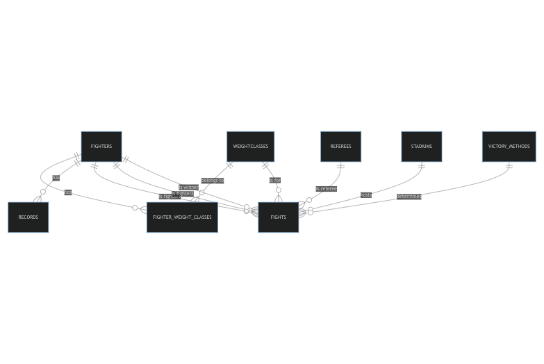

# Design Document

Video overview: <https://youtu.be/vNjN6DwVcqM>

## Scope

The MMA database includes all entities necessary to facilitate the process of tracking MMA fights. The entities are as follows:

* Fighters, including basic identifying information such as first name, nickname, and last name.
* Referees, including basic identifying information such as first name and last name.
* Weightclasses
* Fighter weightclasses, referencing fighters and weightclasses entities.
* Victory Methods
* Stadiums, inlcluding basic identifying information such as name and location.
* Fights, includes basic identifying information such as date, winnner and notes column if necessary. While also referencing, stadiums,fighters, referees, weightclasses, and victory methods entities.
* Records, including wins, losses, draws and no contests.

Out of scope are elements such as which round a fight was won and type of submission(triangle choke, rear naked choke etc) or tko/ko(elbows, kicks, ground and pound etc). As well as, additional personal details of fighters and referees.

## Functional Requirements

This database will support:

* CRUD operations for fighters, referees, stadiums.
* Tracking all fights and their winners and method of victory.
* Updating records accordingly using triggers.
* A fights view to provide a readable format of the fights entity.

Note that in this iteration, logic to update draws and no contests in records entity is not included.

## Representation

Entities are captured in SQLite tables with the following schema.

### Entities

The database includes the following entities:

* **Fighters**: Represents fighters with attributes like `id`, `first_name`, `nickname`, and `last_name`.
* **Referees**: Represents referees with attributes `id`, `first_name`, and `last_name`.
* **Weightclasses**: Represents various weight classes with attributes `id` and `weightclass`.
* **fighter_weight_classes**: Represents the many-to-many relationship between fighters and weight classes.
* **victory_methods**: Represents the ways in which a fighter can achieve victory, with attributes `id` and `victory_method`.
* **Stadiums**: Represents venues or stadiums with attributes like `id`, `name`, and `location`.
* **Fights**: Represents the fights that take place with various attributes including references to fighters, referees, stadiums, weight classes, and victory methods.
* **Records**: Represents the record of each fighter with attributes like wins, losses, draws, and no contests.

### Relationships

The below entity relationship diagram describes the relationships among the entities in the database.

As detailed by the diagram:

* **Fighter_weight_classes**
  * Has a many-to-many relationship with `fighters` and `weightclasses`. One fighter can be in multiple weight classes, and one weight class can have multiple fighters.

* **Fights**:
  * Has a many-to-one relationship with `stadiums`: One stadium can host multiple fights, but each fight is in one stadium.
  * Has a many-to-one relationship with `weightclasses`: A weight class can be associated with multiple fights, but each fight is for a specific weight class.
  * Has a many-to-one relationship with `fighters` for `fighter_id1`, `fighter_id2`, and `winner_id`: A fighter can participate in and win multiple fights, but each fight has specific fighters participating and one winner.
  * Has a many-to-one relationship with `referees`: A referee can officiate multiple fights, but each fight has one referee.
  * Has a many-to-one relationship with `victory_methods`: A victory method can be associated with multiple fights, but each fight has one victory method.

* **Records**
  * Has a one-to-one relationship with `fighters`: Each fighter has one record.

## Optimizations

### Views, Triggers, and Indexes:

* **Fights_view**:
  * Is a view that provides a comprehensive look into fights, joining various tables to provide detailed information.

* **Triggers**:
  * There are triggers to initialize records for fighters when a fight is added.
  * Triggers also update the records with wins or losses after a fight is added.

* **Indexes**:
  * Several indexes have been created to optimize search and query operations on various tables.

## Limitations

In this iteration the current schema does not include logic for draws and no contests. Also the fighters table does not include additional fighter details such as height, reach, age, etc. As database grows, indexes and query performance should be re-evaluated.

